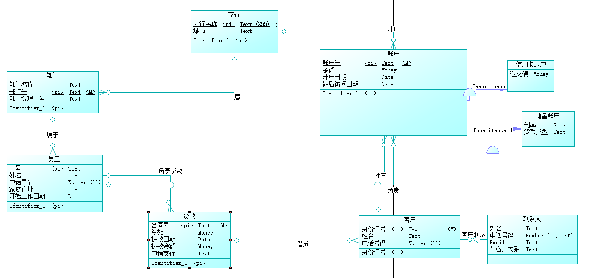
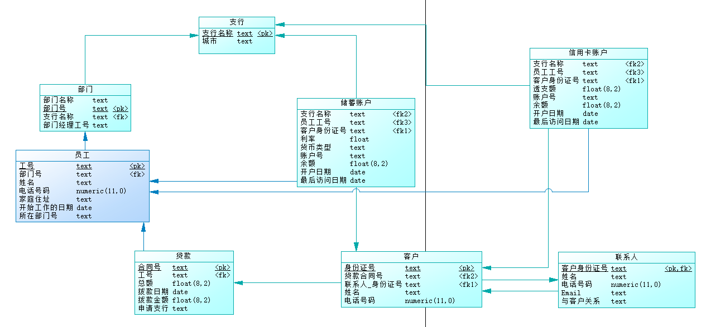

# 银行业务管理系统数据库设计

## PB21010362 汪兆辰

---

## 1. 概念模型设计

**1.1 实体设计**

* 支行
  * 支行名称（主键）
  * 城市

每个支行有唯一的名称，且位于特定的城市，便于管理和监控资产

* 客户
  * 身份证号（主键）
  * 姓名
  * 联系电话

银行的客户通过其身份证号来标识。银行存储每个客户的姓名、联系电话以及家庭住址

* 联系人（作为客户的弱实体）
  * 姓名
  * 手机号
  * Email
  * 与客户的关系

银行还要求客户提供一位联系人的信息，包括联系人姓名、手机号、 Email 以及与客户的关系

* 银行员工
  * 工号（主键）
  * 姓名
  * 电话号码
  * 家庭住址
  * 开始工作的日期

银行员工也通过工号来标识，每个支行的管理机构存储每个员工的姓名、电话号码、家庭地址、所在的部门号、部门名称、部门类型及部门经理的工号，银行还需知道每个员工开始工作的日期。

* 部门
  * 部门号（主键）
  * 部门名称
  * 经理工号

每个部门经理都负责领导其所在部门的员工，并且每个员工只允许在一个部门内工作
* 账户
  * 账户号（主键）
  * 余额
  * 开户日期
  * 最后访问日期

帐户可以由多个客户所共有，一个客户也可开设多个账户，但在一个支行内最多只能开设一个储蓄账户和一个信用卡账户。每个帐户被赋以全行唯一的帐户号。银行记录每个帐户的余额、 开户日期、 开户的支行名以及每个帐户所有者访问该帐户的最近日期

* 储蓄账户（作为账户的子类）
  * 利率
  * 货币类型
* 信用卡账户（作为账户的子类）
  * 透支额
* 贷款
  * 合同号（主键）
  * 总额
  * 拨款日期
  * 拨款金额

一个客户最多只能申请一次贷款。具体贷款业务需要在某个支行申请，银行需要知道一笔贷款具体办理的支行名称以及贷款的合同号和总额，并且规定一笔贷款可以被一个或多个客户所共有。一旦客户申请贷款成功，银行将把总的贷款分几次拨付给客户，并且需要记录每次拨付贷款的具体日期和拨付金额

**1.2 联系设计**

* 开户（支行与账户）：1:N，一个支行可以有多个账户，但一个账户只能属于一个支行
* 下属（支行与部门）：1:N，一个支行可以有多个部门，但一个部门只能属于一个支行
* 拥有（客户与账户）：1:N，一个客户可以有多个账户，但一个账户只能属于一个客户。
* 借贷（客户与贷款）：1:1或1:N，一个客户最多只能申请一次贷款，但一笔贷款可以由多个客户共有
* 负责（员工与账户）：1:N，一个员工可以负责多个账户，但每个账户只由一个员工负责
* 负责贷款（员工与贷款）：1:N，一个员工可以负责多个贷款，但每个贷款只由一个员工负责
* 属于（员工与部门）：1:N，一个员工可以属于多个部门，但每个部门只由一个员工负责

**1.3 Power Designer的ER图**

## 2. 概念模型到逻辑模型的转换

**2.1 实体转换**

* 支行（<u>支行名称</u>，城市）
* 客户（<u>身份证号</u>，姓名，联系电话）
* 联系人（<u>客户身份证号</u>，联系人姓名，手机号，Email，与客户的关系）
* 员工（<u>工号</u>，姓名，电话号码，家庭住址，开始工作的日期）
* 部门（<u>部门号</u>，部门名称，经理工号）
* 储蓄账户（<u>账户号</u>，余额，开户日期，最后访问日期，利率，货币类型）
* 信用卡账户（<u>账户号</u>，余额，开户日期，最后访问日期，透支额）
* 贷款（<u>合同号</u>，申请支行，总额，拨款日期，拨款金额）

**2.2 联系转换**

根据与账户的联系，在账户中添加属性

* 储蓄账户（<u>账户号</u>，余额，开户日期，最后访问日期，利率，货币类型，开户行名称，客户身份证号，负责员工）
* 信用卡账户（<u>账户号</u>，余额，开户日期，最后访问日期，透支额，开户行名称，客户身份证号，负责员工）

同样对于与贷款的联系，在贷款中添加属性

* 贷款（<u>合同号</u>，申请支行，总额，拨款日期，拨款金额，负责员工）

但由于贷款的借贷联系是多对一的，因此考虑在客户表中添加贷款属性

* 客户（<u>身份证号</u>，姓名，联系电话，贷款合同号）

对于与部门的联系，在员工表中添加部门属性，并在部门表中添加支行属性

* 员工（<u>工号</u>，姓名，电话号码，家庭住址，开始工作的日期，所在部门号）
* 部门（<u>部门号</u>，部门名称，经理工号，支行）

**2.3 最终的关系模式**

* 储蓄账户（<u>账户号</u>，余额，开户日期，最后访问日期，利率，货币类型，开户行名称，客户身份证号，负责员工）
* 信用卡账户（<u>账户号</u>，余额，开户日期，最后访问日期，透支额，开户行名称，客户身份证号，负责员工）
* 员工（<u>工号</u>，姓名，电话号码，家庭住址，开始工作的日期，所在部门号）
* 部门（<u>部门号</u>，部门名称，经理工号，支行）
* 客户（<u>身份证号</u>，姓名，联系电话，贷款合同号）
* 贷款（<u>合同号</u>，申请支行，总额，拨款日期，拨款金额，负责员工）
* 联系人（<u>客户身份证号</u>，联系人姓名，手机号，Email，与客户的关系）
* 支行（<u>支行名称</u>，城市）

## 3. MySQL数据库结构实现

**3.1 Power Designer的PDM图**

**3.2 数据库表定义**

**表1：支行**
|中文名|字段名|类型|主键|索引|不可空|
|:-:|:-:|:-:|:-:|:-:|:-:|
|支行名称|BranchName|char(50)|是||是|
|城市|City|char(50)|||是|

**表2：客户**
|中文名|字段名|类型|主键|索引|不可空|
|:-:|:-:|:-:|:-:|:-:|:-:|
|身份证号|IDNum|char(50)|是||是|
|贷款合同号|	ContractNum|	char(50)|		|贷款（合同号）	|
|联系人姓名|	Con_Name|	char(50)|		|联系人（姓名）	|是|
|姓名	|Name|	char(50)|		||	是|
|电话号码|	Phone|	numeric(11)|||			是|

**表3：联系人**
|中文名|字段名|类型|主键|索引|不可空|
|:-:|:-:|:-:|:-:|:-:|:-:|
|客户身份证号|	IDNum|	char(50)|	是|	客户（身份证号）|	是|
|姓名	|Name	|char(50)|	|		|是|
|电话号码|	Phone|	numeric(11)|	||		是|
|Email	|Email|	char(50)			|||是|
|与客户关系	|Relationship	|char(50)|||			是|

**表4：部门**
|中文名|字段名|类型|主键|索引|不可空|
|:-:|:-:|:-:|:-:|:-:|:-:|
|部门名称|	DepartName|	char(50)|||			是|
|部门号|	DepartNum	|char(50)	|是|	是	|是|
|支行名称	|BranchName|	char(50)||		支行（支行名称）|	是|
|部门经理工号|	DepartManager	|char(50)	|	|	|是|
          
**表5：贷款**			
|中文名|字段名|类型|主键|索引|不可空|
|:-:|:-:|:-:|:-:|:-:|:-:|
|合同号|	ContractNum|	char(50)	|是|	是	|是|
|工号	|EmployeeID	|char(50)	|	|员工（工号）|	|是|
|总额	|TotalAmount|	float(8)|	||		是|
|拨款日期|	InstallmentDate|	date	|	|||	
|拨款金额|	InstallmentAmoun|	float(8)|			
|申请支行|	Branch|	char(50)	|	|支行（支行名称）|	是
          
**表6：信用卡账户**			
|中文名|字段名|类型|主键|索引|不可空|
|:-:|:-:|:-:|:-:|:-:|:-:|
|支行名称|	BranchName|	char(50)|	|	支行（支行名称）|	是
|员工工号	|EmployeeID	|char(50)	|	|员工（工号）	|是
|客户身份证号|	IDNum|	char(50)|		|客户（身份证号）|	是
|透支额	|Overdraft|	float(8)|		||	是
|账户号	|AccountID|	char(50)|	是|	是|	是
|余额	|Balance|	float(8)|		||	是
|开户日期|	OpenDate|	date|			||是
|最后访问日期|	LastAccessDate|	date|||			是
          
**表7：储蓄账户**			
|中文名|字段名|类型|主键|索引|不可空|
|:-:|:-:|:-:|:-:|:-:|:-:|
|支行名称	|BranchName|	char(50)|		|支行（支行名称）|	是
|员工工号	|EmployeeID|	char(50)|		|员工（工号）	|是
|客户身份证号|	IDNum|	char(50)|		|客户（身份证号）	|是
|利率	|Ratio	|float	||		|是
|货币类型|	CurrenctType|	char(50)|||			是
|账户号	|AccountID|	char(50)	|是	|是|	是
|余额	|Balance	|float(8)	|||		是
|开户日期	|OpenDate|	date	|||		是
|最后访问日期|	LastAccessDate	|date|||			是
          
**表8：员工**			
|中文名|字段名|类型|主键|索引|不可空|
|:-:|:-:|:-:|:-:|:-:|:-:|
|工号|	EmployeeID|	char(50)|	是	|是	|是
|部门号|	DepartNum|	char(50)			
|姓名	|Name|	char(50)	|||		是
|电话号码|	Phone|	numeric(11)|||			是
|家庭住址|	Address|	char(50)|||			是
|开始工作的日期|	StartDate	|date|||			是
|所在部门号|	DepartID|	char(50)	||	部门（部门号）	
